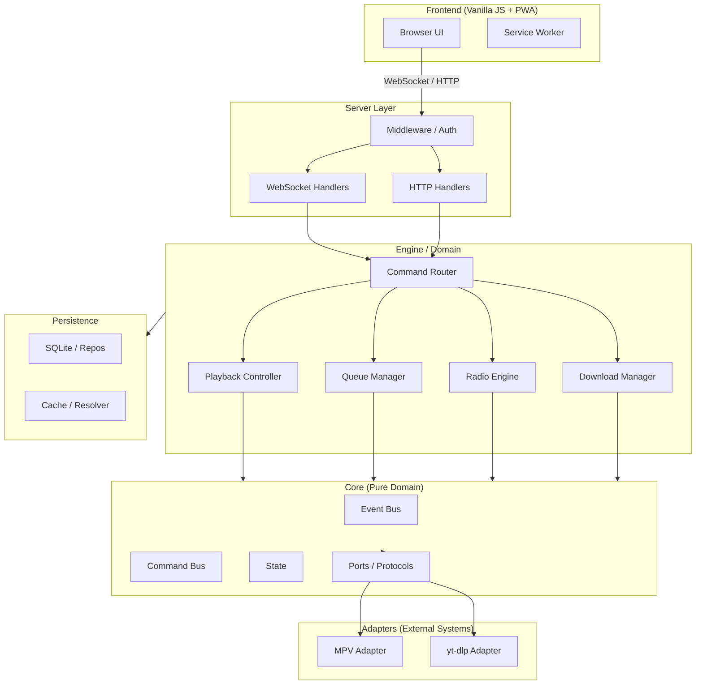

# LunaWave — Documentation Hub

> **Ini bukan sprint. Bukan deadline. Bukan checklist.**
> Ini kompas — gambaran "kalau LunaWave mendekati sempurna, begini bentuknya."
>
> **Prinsip #1:** 1 file kode = 1 tanggung jawab
> **Prinsip #2:** 1 file kode (yang testable) = 1 file test
> **Prinsip #3:** Setiap penambahan harus punya alasan jelas — tidak ada yang ditambah demi terlihat canggih

---

## Visi Proyek

LunaWave adalah aplikasi music player personal berbasis web dengan backend Python. Arsitekturnya dirancang dengan prinsip hexagonal (ports & adapters), memisahkan domain logic dari sistem eksternal (MPV, yt-dlp, SQLite). Frontend menggunakan vanilla JS tanpa framework, PWA-ready.

Proyek ini dirancang agar:
- Bisa dijalankan dari nol oleh orang baru hanya dengan mengikuti dokumentasi
- Mudah di-test karena domain logic murni tidak bergantung pada I/O
- Siap dijadikan proyek open source profesional
- Bisa dipelihara jangka panjang tanpa cognitive overhead yang besar

---

## Filosofi Engineering

**Single Responsibility** — setiap file punya satu alasan untuk berubah.

**Single Source of Truth** — setiap fakta hanya ada di satu tempat. Dokumen lain memberikan referensi, bukan salinan.

**Honest Engineering** — CI harus jujur. Kalau sesuatu belum ada, jangan diklaim sudah ada. Kalau ada bug, akui di dokumentasi.

**Conservative Change** — file yang belum disentuh tetap jalan seperti biasa. Tidak ada refactor demi refactor. Perubahan dilakukan kalau ada alasan nyata.

**Documentation as Code** — dokumentasi diperlakukan seperti kode: versi dikontrol, konsisten, tidak duplikat.

---

## Prinsip Arsitektur

```
core/ → tidak boleh import apapun di luar core/
adapters/ → boleh import core/ saja
persistence/ → boleh import core/ saja
engine/ → boleh import core/, adapters/, persistence/ (lewat ports)
server/ → boleh import core/, engine/, services/, persistence/
plugins/ → boleh import core/ saja
```

Aturan ini ditegakkan via `.importlinter` di CI (otomatis) dan didokumentasikan di → [architecture/dependency_rules.md](architecture/dependency_rules.md).

---

## Dashboard Angka

| Layer | Sekarang | Target | Dokumen |
|---|---|---|---|
| Backend `.py` (kode) | 54 file | ~80 file | [architecture/backend.md](architecture/backend.md) |
| Backend `.py` (test) | 0 file | ~65 unit + ~4 integration | [testing/unit_testing.md](testing/unit_testing.md) |
| Frontend `.js` (kode) | 23 file, 2.813 baris | ~32 file | [architecture/frontend.md](architecture/frontend.md) |
| Frontend `.js` (test) | 0 file | ~3–5 file (opsional) | [testing/frontend_testing.md](testing/frontend_testing.md) |
| Frontend `.css` | 22 file, 3.274 baris | ~24–26 file | [frontend/ui_architecture.md](frontend/ui_architecture.md) |
| Frontend `.html` | 1 file, 677 baris | 1 file (tidak dipecah) | [frontend/pwa.md](frontend/pwa.md) |
| Data & schema | 3 file | 3 file (direlokasi) | [backend/persistence.md](backend/persistence.md) |
| Config tooling baru | 0 | 3 file | [devops/tooling.md](devops/tooling.md) |
| ADR | 0 | 6 file | [adr/](adr/) |
| File > 200 baris (semua layer) | ~12 | ~0 | — |

---

## Diagram Arsitektur Tingkat Tinggi



---

## Struktur Dokumentasi

```
docs/
├── Blueprint.md                  ← Anda sedang di sini
├── architecture/                 ← Keputusan & struktur sistem
├── backend/                      ← Detail implementasi backend
├── frontend/                     ← Detail implementasi frontend
├── testing/                      ← Strategi & panduan testing
├── devops/                       ← CI/CD, tooling, release
├── security/                     ← Security & threat model
├── development/                  ← Onboarding & standar kode
├── opensource/                   ← Contributing & readiness
├── adr/                          ← Architecture Decision Records
└── rfc/                          ← Request for Comments (masa depan)
```

---

## Daftar Dokumentasi Lengkap

### Architecture
- [architecture/overview.md](architecture/overview.md) — Visi & prinsip arsitektur
- [architecture/backend.md](architecture/backend.md) — Peta modul Python
- [architecture/frontend.md](architecture/frontend.md) — Peta modul JS & CSS
- [architecture/domain.md](architecture/domain.md) — Domain model hexagonal
- [architecture/folder_structure.md](architecture/folder_structure.md) — Folder tree lengkap
- [architecture/dependency_rules.md](architecture/dependency_rules.md) — Aturan arah dependency
- [architecture/data_flow.md](architecture/data_flow.md) — Data flow & request flow
- [architecture/layer_diagram.md](architecture/layer_diagram.md) — Diagram layer
- [architecture/technology_stack.md](architecture/technology_stack.md) — Stack & alasan pilihan

### Backend
- [backend/services.md](backend/services.md) — Engine, services, plugins
- [backend/persistence.md](backend/persistence.md) — SQLite, repositories, data
- [backend/api.md](backend/api.md) — HTTP & WebSocket API
- [backend/background_jobs.md](backend/background_jobs.md) — Download manager, radio prefetch
- [backend/caching.md](backend/caching.md) — Cache resolver & MP3 cache

### Frontend
- [frontend/ui_architecture.md](frontend/ui_architecture.md) — Peta modul JS & strategi CSS
- [frontend/pwa.md](frontend/pwa.md) — PWA, manifest, service worker
- [frontend/state_management.md](frontend/state_management.md) — store.js & state sync
- [frontend/routing.md](frontend/routing.md) — Event routing & WS message routing

### Testing
- [testing/README.md](testing/README.md) — Quick start testing
- [testing/testing_strategy.md](testing/testing_strategy.md) — Filosofi & coverage target
- [testing/unit_testing.md](testing/unit_testing.md) — Panduan & tabel unit test
- [testing/integration_testing.md](testing/integration_testing.md) — Integration test scenarios
- [testing/frontend_testing.md](testing/frontend_testing.md) — Frontend test (opsional)
- [testing/performance_testing.md](testing/performance_testing.md) — Benchmark (placeholder)

### DevOps
- [devops/ci_cd.md](devops/ci_cd.md) — Pipeline CI/CD
- [devops/tooling.md](devops/tooling.md) — Config file & pre-commit
- [devops/deployment.md](devops/deployment.md) — Cara deploy & run
- [devops/packaging.md](devops/packaging.md) — pyproject.toml & requirements
- [devops/release.md](devops/release.md) — Release workflow & SemVer

### Security
- [security/security.md](security/security.md) — Vulnerability reporting
- [security/threat_model.md](security/threat_model.md) — Threat model & secret management

### Development
- [development/coding_standard.md](development/coding_standard.md) — Standar kode & type checking
- [development/onboarding.md](development/onboarding.md) — Setup dari nol
- [development/project_structure.md](development/project_structure.md) — Peta risiko perubahan

### Open Source
- [opensource/contributing.md](opensource/contributing.md) — Cara berkontribusi
- [opensource/readiness.md](opensource/readiness.md) — Open source checklist
- [opensource/release_process.md](opensource/release_process.md) — Proses release publik

### ADR — Architecture Decision Records
- [adr/0001-mpv-ipc-over-subprocess.md](adr/0001-mpv-ipc-over-subprocess.md)
- [adr/0002-sqlite-over-json-cache.md](adr/0002-sqlite-over-json-cache.md)
- [adr/0003-hexagonal-ports-protocol.md](adr/0003-hexagonal-ports-protocol.md)
- [adr/0004-command-bus-single-writer.md](adr/0004-command-bus-single-writer.md)
- [adr/0005-websocket-single-channel.md](adr/0005-websocket-single-channel.md)
- [adr/0006-vanilla-js-over-framework.md](adr/0006-vanilla-js-over-framework.md)

---

## Cara Membaca Dokumentasi Ini

**Baru ke proyek?** Mulai dari [development/onboarding.md](development/onboarding.md).

**Ingin memahami arsitektur?** Mulai dari [architecture/overview.md](architecture/overview.md), lalu [architecture/layer_diagram.md](architecture/layer_diagram.md).

**Ingin menulis test?** Mulai dari [testing/README.md](testing/README.md).

**Ingin berkontribusi?** Mulai dari [opensource/contributing.md](opensource/contributing.md).

**Ada keputusan arsitektur yang ingin dipahami?** Lihat folder [adr/](adr/).

**Ada bug atau perubahan?** Catat di `docs/PATCHLOG.md` (dokumen existing, tidak diubah).

---

*Dokumen ini boleh basi. Kalau repo berubah signifikan, kompas ini yang menyesuaikan — bukan sebaliknya.*
